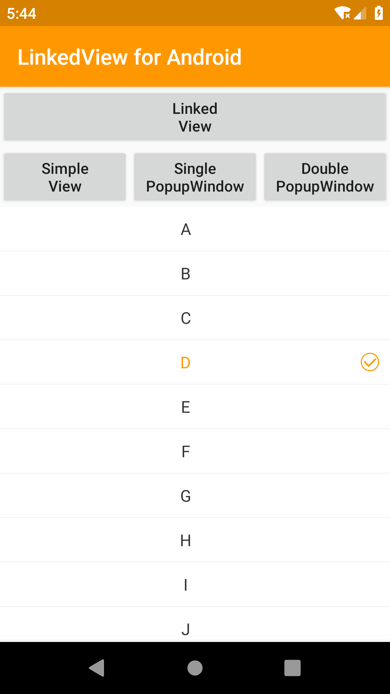
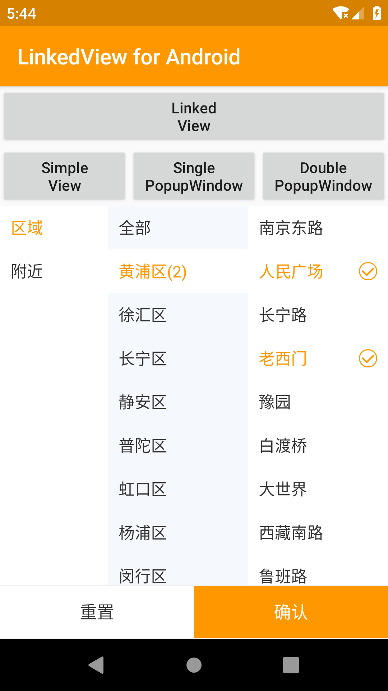
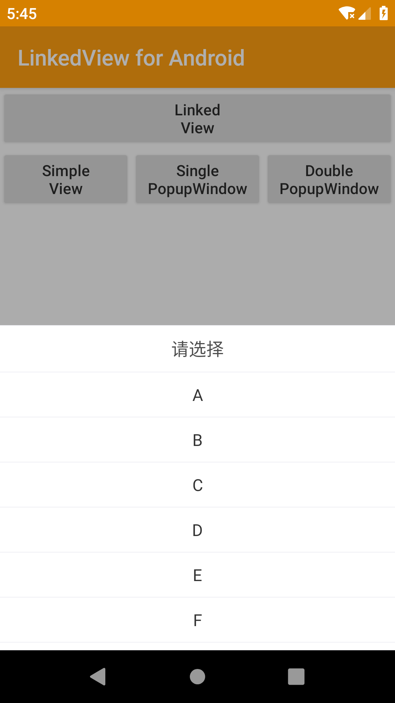
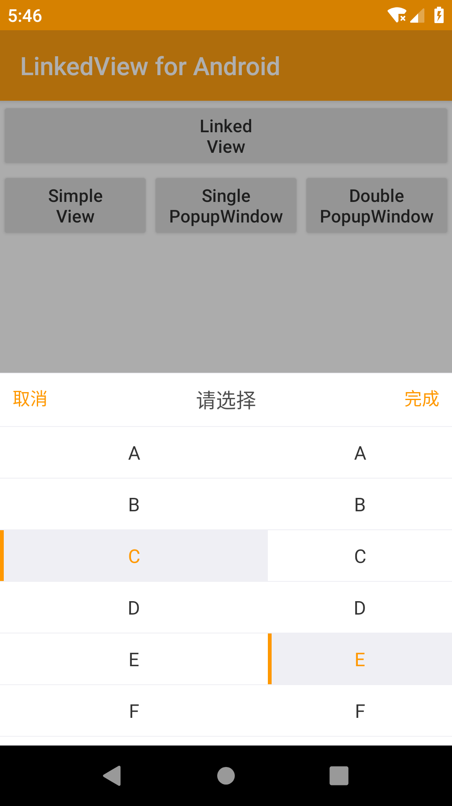

# Android-Linked-View


[](https://travis-ci.org/wzbos/Android-Linked-View)
[](http://jcenter.bintray.com/cn/wzbos/android/widget/linkedview)

## Gradle Dependency

``` groovy
buildscript {
    repositories {
        jcenter()
    }
}
dependencies {
    implementation "cn.wzbos.android.widget:linkedview:1.0.0"
}
```

## Simple usage

``` java
linkedView.setOnPickedListener(new ILinked.OnPickedListener(){
    @Override
    public void onPicked(ILinked linkView,PickerResult result){
        Toast.makeText(MainActivity.this,result.toString(),Toast.LENGTH_SHORT).show();
    }
});
linkedView.setData(data);
```

>[Json data format](./app/src/main/assets/area.json)


## LinkedView
&nbsp;&nbsp;&nbsp;


``` java
        linkedView.setOnCreatePickerViewListener(new ILinked.OnCreatePickerViewListener() {
            @Override
            public void onCreatePickerView(PickerView prevView, int prevPosition, PickerView nextView, int nextPosition) {
               
            }
        });
        linkedView.setOnPickerViewItemClickedListener(new ILinked.OnPickerViewItemClickedListener() {
            @Override
            public void onPickerViewItemClicked(PickerView pickerView, int position, IPickerData data) {
               
            }
        });
        linkedView.setOnPickedListener(new ILinked.OnPickedListener() {
            @Override
            public void onPicked(ILinked linkView, PickerResult result) {
                Toast.makeText(MainActivity.this, result.toString(), Toast.LENGTH_SHORT).show();
            }
        });
        linkedView.setData(data);
```

## LinkedPopupWindow

&nbsp;&nbsp;


``` java
 LinkedPopupWindow popupWindow = new LinkedPopupWindow(this);
                popupWindow.setDivider(true);
                popupWindow.addPickerView(new PickerView(this)
                        .setWidth(200)
                        .setShowDivider(true)
                        .setStateBackground(R.drawable.bg_item_pop)
                        .setTxtAlignment(View.TEXT_ALIGNMENT_CENTER)
                        .setData(getPickerData()));
                popupWindow.addPickerView(new PickerView(this)
                        .setData(getPickerData())
                        .setShowDivider(true)
                        .setTxtAlignment(View.TEXT_ALIGNMENT_CENTER)
                        .setStateBackground(R.drawable.bg_item_pop));
                popupWindow.setOnPickedListener((linkView, result) -> Toast.makeText(MainActivity.this, result.toString(), Toast.LENGTH_SHORT).show());
                popupWindow.showAtBottom(view);
```


